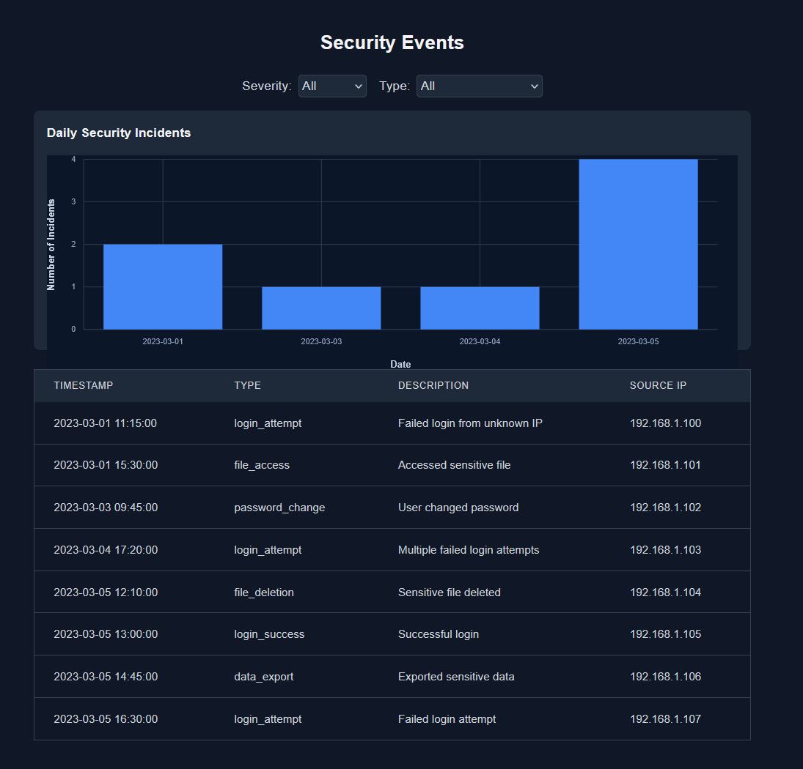

# Security Event Monitor

A full-stack application for monitoring security events using React, TypeScript, Apollo GraphQL, TailwindCSS, and Elastic Charts for data visualization.



## Project Structure
- `client/`: Frontend React application
- `server/`: Backend GraphQL API

## Getting Started

### Using Makefile (Recommended)
This project includes a Makefile to simplify common operations:

```bash
# Install all dependencies
make install

# Start the server
make server

# Start the client
make client

# Run tests
make test

# Clean up node_modules and build artifacts
make clean
```